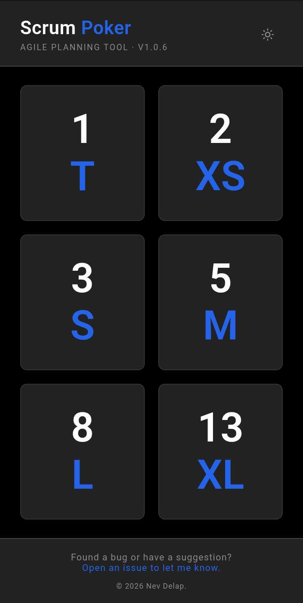

# Scrum Poker — Agile Planning Tool

A free scrum poker app for agile teams. Estimate user stories together in
real time without needing a dedicated tool or subscription.

<br>
*Scrum Poker on mobile.*

Everything runs in the browser — no account, no server, no API calls.

**[https://nevdelap.github.io/scrum-poker/](https://nevdelap.github.io/scrum-poker/)**

## Features

- **Simple estimation** — pick a card value and reveal estimates as a team
- **Light and dark modes** — follows your system preference, or can be set manually
- **Mobile-first** — designed for phones and tablets, but works on desktop too
- **Free and open source** — no sign-up, no ads, no tracking beyond basic analytics

## How it works

A single-page static web app with no external dependencies beyond fonts.
All state is local to the browser session.

## License

- App code: [MIT](LICENSE)

## Local development

```bash
just serve    # serve locally and open in browser
just format   # format Markdown
just lint     # format then lint
```
